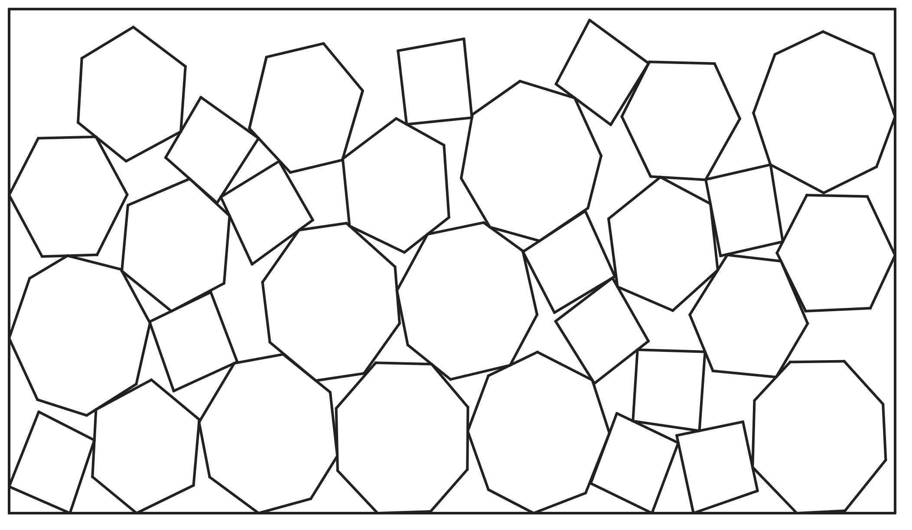
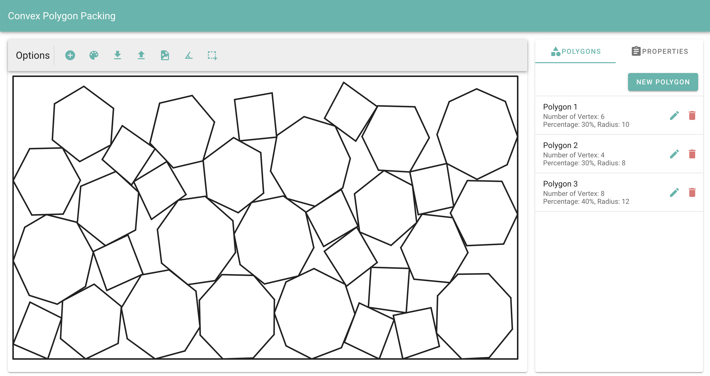
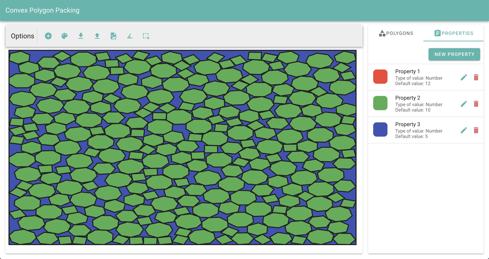
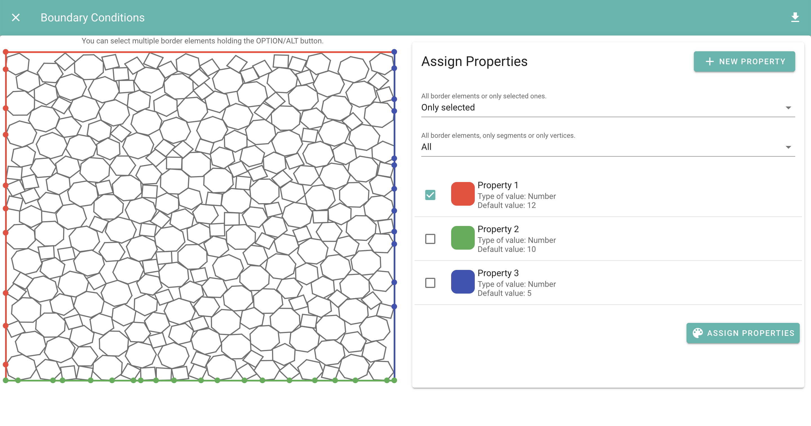
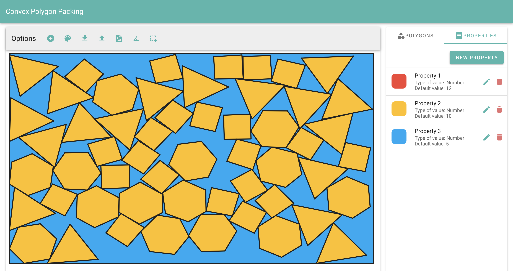
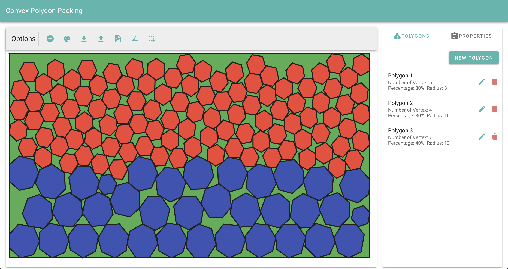

# Geometric Packing for Convex Polygons

## Table of Contents
* [Introduction](#introduction)  
* [Screenshots](#screenshots)  
* [Demo](#demo)  
* [Documentation](#documentation)  
* [Installation](#installation)  
* [License](#license)  

## Introduction

A geometric packing is an non polynomial problem (NP problem) 
that tries to pack different types of geometric figures into a 
finite space. We will focus on a convex polygon geometric packing.

As an example the next image shows the result of a geometric packing
 with three different kinds of polygons.
 


This repository provides a simple app that allows you to generate a 
variety of packing meshes. The app has the following features:

* Geometric packing mesh generation.
    * Pack polygons with one container or multiple 
    layers of containers (containers of the same width)
    * Two different approaches for the geometric packing algorithm.
    * Adjustable polygon variability
* Assignable properties for polygons on the mesh.
* Download mesh file on txt and json format.
* Upload mesh file.
* Download image of mesh generated.
* Mesh refinement.
* Plugin for boundary conditions
    * Assign properties to vertices and segments 
    on the boundary of the container. 




## Screenshots






## Demo

Try using the app on this [link](http://create.cl:9872/)

## Documentation 

* [User Manual Documentation](https://github.com/juakotorres/PackingAlgorithms/wiki/User-Manual)
* [API Documentation](https://github.com/juakotorres/PackingAlgorithms/wiki/API-Documentation)

## Installation

### Requirements

* Java 1.8
* Play Library
* SBT (Scala)
* Node (npm)

### Development

For development you first need to clone the repository and install all the node libraries.

```
git clone https://github.com/juakotorres/PackingAlgorithms.git
cd front/
npm install
```

After installing the nodes libraries needed you can start the application using:

```
sbt run
``` 


### Production

First enter the Play console:

```
sbt
```

Then for production we need to compile the project into JAR files using:

```
sbt dist
```

This produces a ZIP file containing all JAR files needed to
 run the application in the ```targer/universal``` folder. 
 To run the application, unzip the file on the target server,
  and then run the script in the ```bin``` directory. 

```
cd target/universal
unzip packvex-1.1.zip
cd packvex-1.1/
bin/packvex
 ```
 
 ## License
 
 MIT
